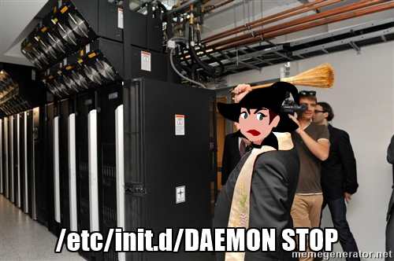

> processes and signals

## Intro
Here, we will explore the inner workings of the Linux operating system and how it manages and interacts with the programs that run on it. We will delve into the concept of a process, how it is created, managed and terminated by the OS, and how you as a user or a developer can interact with them using various command-line utilities and programming interfaces. Additionally, we will also take a closer look at signals, which are a key mechanism for the operating system to communicate with processes, and how they are used to interrupt, terminate, or notify processes of events. Whether you're a Linux novice or an experienced user or developer, this project will provide valuable insights into the fundamental concepts of Linux and how they apply to everyday usage. 

Buckle up. Lets go!
> Why was the linux process killed? Because it couldn't handle the signals :smiley: :smiley:

> Why was the process feeling low? Because it was in a state of zombie :laughing: :laughing:

## About
In Linux, a process is an instance of a program that is being executed by the operating system. Each process has its own memory space and system resources, and can interact with the kernel (the core of the operating system) to perform various operations. Processes can be created, terminated, and managed using various command-line utilities and programming interfaces.

A signal is a way for the operating system to communicate with a process. Signals are used to interrupt or terminate a process, or to send a notification to a process that an event has occurred. Signals are identified by a unique integer value, and can be generated by the operating system or by other processes. Signals can be handled by the process itself or ignored. Common signals include SIGINT (generated when the user presses the "CTRL+C" key combination), SIGTERM (used to request that a process terminate gracefully), and SIGKILL (used to forcefully terminate a process).

## Resources
__Read or Watch__
1. [Linux PID](http://www.linfo.org/pid.html)
2. [Linux Processes](https://www.thegeekstuff.com/2012/03/linux-processes-environment/)
3. [Linux signal](https://www.educative.io/answers/what-are-linux-signals)
4. [Process management in Linux](https://www.digitalocean.com/community/tutorials/process-management-in-linux)
5. [Google](https://www.google.com/search?&q=linux+process+and+signals)
6. [Youtube](https://www.youtube.com/results?search_query=process+and+signals+in+linux)